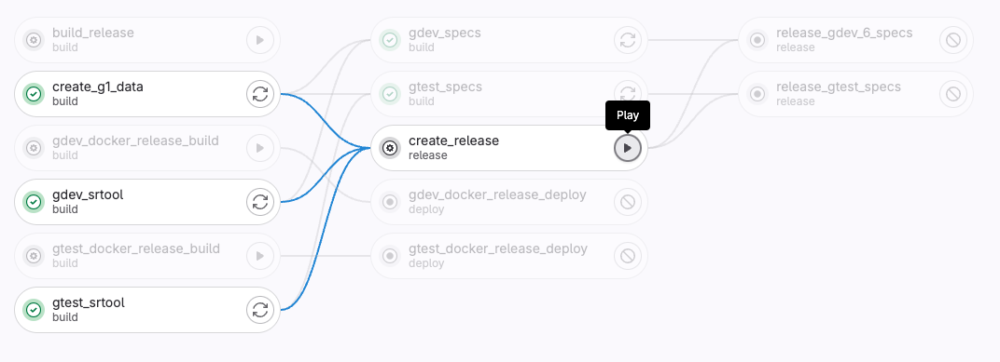

# Release a new Runtime

> The following instructions have been described in french at: [Créer une release](https://forum.duniter.org/t/industrialiser-le-demarrage-dune-nouvelle-gx/11535/41).

## Process

Example for `runtime-800`.

### New release with new Runtime

- create a `release/runtime-800` branch locally [FIXME network/gdev-800]
- update the values:
  - update spec version (in `runtime/<currency>/src/lib.rs`)
  - eventually update `gdev.yml` (smiths, tech. committee, ...) [FIXME this should be only for bootstraping new network]
  - [+ update the Cargo.lock file]
  - [+ FIXME milestones should be updated before that]
- push the `release/runtime-800` branch
  - in the CI/CD, wait for `Create release` button to be available and click on it (see above screenshot)

The Runtime is now available on the release page [runtime-800](https://git.duniter.org/nodes/rust/duniter-v2s/-/releases/runtime-800).

### New Client

The Client is published as a Docker image.

You may want to publish a new Client version along with a Runtime update.
[NOTE only necessary in the case of breaking changes in the API]

#### New raw specs (optional)

[FIXME we should split the release runtime doc and the bootstrap network doc]

For a reboot, you will likely want to update the raw specs:

- in the CI/CD, wait for `release_gdev_specs` button to be available and click on it
- in the CI/CD, wait for `release_gtest_specs` button to be available and click on it
- wait for both jobs to finish
- update the Client raw specs with `cargo xtask update-raw-specs runtime-800`

#### New version (mandatory)

Update Client values:

- update Client version (in `Cargo.toml`)
- update `Cargo.lock` with `cargo build`

#### Publish Docker image

Commit everything and push the branch:

- in the CI/CD, a new pipeline has been launched
- you can stop jobs `create_g1_data`, `gdev_srtool`, `gtest_srtool` (won't be used)
- click on `gdev_docker_deploy` and `gtest_docker_deploy`

The Docker images should now be available at: https://hub.docker.com/r/duniter/duniter-v2s-gdev/tags.

## Runtime tag and spec version

Our runtime tags use `xxyy` version numbers where `x` corresponds to major change and `y` hotfix.

Make sure to move any issue or merge request assigned to the choosen milestone `runtime-xxyy` to the next one. This prevents from forgetting unfinished work.

## Submit the runtime upgrade proposal

Releasing a new runtime creates a Gitlab release page which contains everything needed to submit a runtime upgrade proposal and upload the new runtime when it gets accepted.
