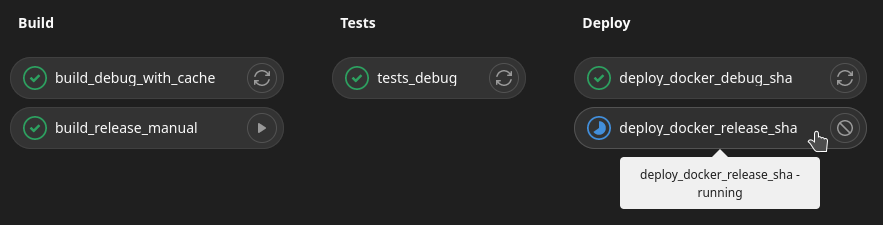

# Release a new runtime

Here you will learn how to release a new runtime using `gitlab ci` and `cargo xtask`.

## Runtime tag and spec version

Our runtime tags use `xxyy` version numbers where `x` corresponds to major change and `y` hotfix.

1. Make sure to move any issue or merge request assigned to the choosen milestone `runtime-xxyy` to the next one. This prevents from forgetting unfinished work.
1. Check that the [CI on release/runtime-XX00](https://git.duniter.org/nodes/rust/duniter-v2s/-/pipelines?scope=all&page=1&ref=runtime-400) (runtime major release branch) is passing. This is necessary to build the docker images.
1. Increment the `spec_version` in the code. Example `spec_version: 300` -> `spec_version: 400`.

Publish the `runtime-400` branch. Go to the pipelines and run the manual tasks as shown on the screenshot below.

- `build_release_manual`
- `deploy_docker_release_sha`



## Release runtime

We choose [`xtask`](https://github.com/matklad/cargo-xtask/) to run Rust scripts using `cargo`. To build these scripts, just run:

```bash
cargo xtask -h # this will build the scripts and show the available commands
```

To interact with GitLab, the `release_runtime` script uses the environment variable `GITLAB_TOKEN` which must contain a token with write permission on the repository. Go to your [personal access token preferences](https://git.duniter.org/-/profile/personal_access_tokens) to generate one and `export` it (you might want to add it to your `.bashrc`). You can then run this command:

```bash
cargo xtask release-runtime 400 # requires to run docker as non-root user
```

This command does the following things (use your system monitor to track the progress as it produces not log):

1. Download the [`paritytech/srtool`](https://docs.substrate.io/reference/command-line-tools/srtool/) (Substrate Runtime TOOLbox) docker image (about 2 minutes with a good connection). It is a docker container enabling to build the Substrate WebAssembly runtime in a deterministic way (machine-independant).
1. Build gdev runtime in release mode using `srtool` (about 5 minutes depending on your computing power). The target is put in the `runtime/gdev/target` folder (about 2GB).
1. Generate release notes using the template in `xtask/res`
1. Publish the release with the notes on GitLab using your `GITLAB_TOKEN`

This release will trigger a GitLab CI publishing a docker image of the Substrate client with embeded runtime. 